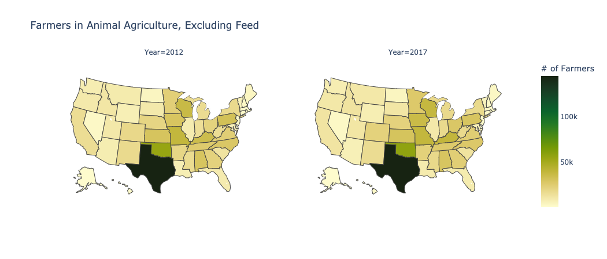
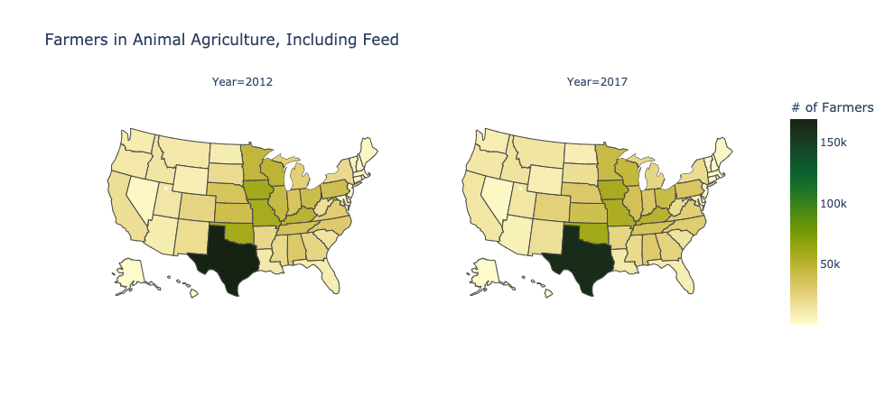
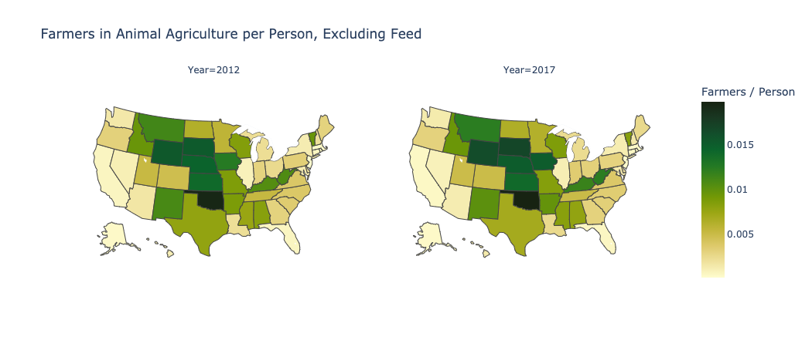
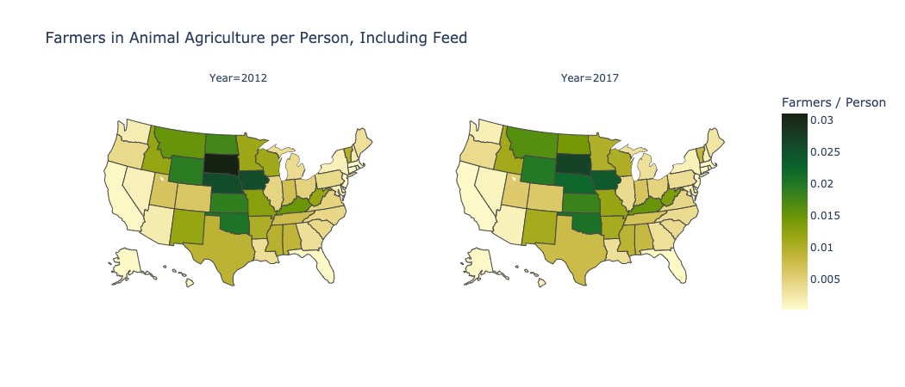
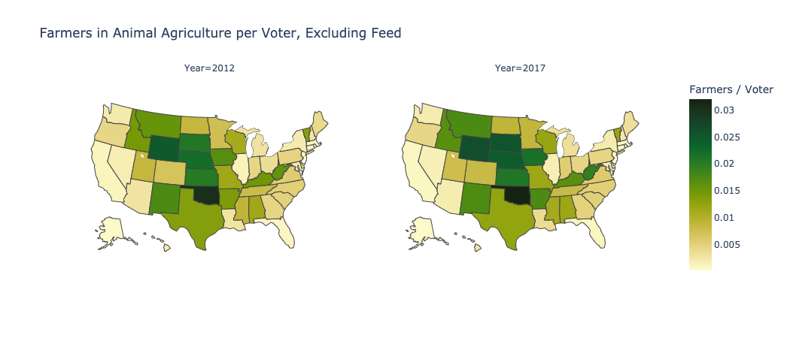
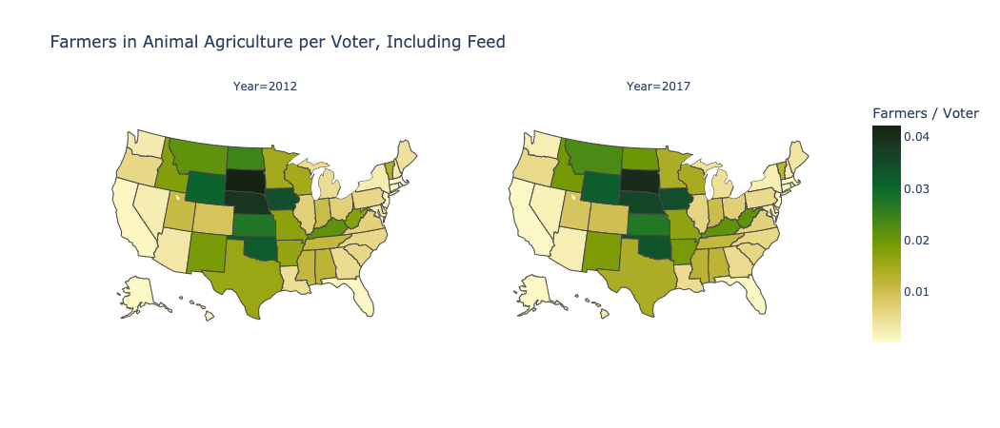

# Rancher Numbers Project (Good Food Institute)
---

This project uses data from the U.S. Department of Agriculture (USDA) to estimate the number of ranchers / family farmers in the United States, by state. Specifically, we compute two estimates of this measure:
- Number of family farmers in animal agriculture, including feed commodities
- Number of family farmers in animal agriculture, exclusing feed commodities

The methods section below further outlines how these values were calculated.

## Methods

### ERS Commodity Data

The Economic Research Service (ERS), which is a subdivision of the USDA, provides the Annual cash receipts by commodity, for each state (data available [here](https://data.ers.usda.gov/reports.aspx?ID=17832))

For each state, we computed the share of animal agriculture by (1) including feed crops and (2) excluding feed crops (both numbers are decimals). The explicit formulas are given below:

<p align="center">
    
</p>

<p align="center">
    
</p>


### NASS Census Data

The National Agricultural Statistice Service (NASS), which is a subdivision of the USDA, provides census data for various farm and crop operations, for each state (data available [here](https://www.nass.usda.gov/Quick_Stats/CDQT/chapter/1/table/1))

For each state, we estimate the number of family farmers by using the "FARM OPERATIONS, ORGANIZATION, TAX PURPOSES, FAMILY & INDIVIDUAL - NUMBER OF OPERATIONS" field in the NASS data. We then multiply this by our previously computed share values to get an estimate for the number of animal farmers in each state.

<p align="center">
    
</p>

<p align="center">
    
</p>

## Exporatory Data Analysis

To understand the geographic distribution of the number of family farmers in animal agriculture, we visualize the raw number of family farmers in the two plots below, without and with feed, respectively.

 



To better understand how the number of farmers compares to the overall population in each state, we also visualized the number of farmers per person in each state, via the equation below:

<p align="center">
    
</p>

Again, we visualize this metric when excluding and including feed commodities, respectively.

 



To better understand how the number of farmers compares to the number of voters in each state, we also visualized the number of farmers per registered voter in each state, via the equation below:

<p align="center">
    
</p>

Again, we visualize this metric when excluding and including feed commodities, respectively.

 

 

## Repository Stucture

### `data/`
Folder than contains the following data files

- `ers_usda.xlsx`: 
    - Excel file containing the annual cash commodities by state, for years 2012 - 2020. 
    - Contains 52 sheets (directory sheet, entire US, and one sheet for each state)
        - **Rows (Granularity)**: Category of commodities
        - **Columns**: Different years
        - **Values**: Annual Cash Receipt for given comodity
    - Entire file is downloadable from the ERS ([here](https://data.ers.usda.gov/reports.aspx?ID=17832))
- `nass_usda.xlsx`:
    - Excel file containing the Number of Family Farmers for each state
        - **Rows (Granularity)**: (State, Year) combination
        - **Columns**: State, Year, Number_of_Family_Farmers
    - Data file was created manually by extracting values from NASS ([here](https://www.nass.usda.gov/Quick_Stats/CDQT/chapter/1/table/1))
        - Equated the field "FARM OPERATIONS, ORGANIZATION, TAX PURPOSES, FAMILY & INDIVIDUAL - NUMBER OF OPERATIONS" with the Number of Family Farmers
    - NASS only has Census data from the years 2012 and 2017
- `census_population_and_voting.xlsx`:
    - Excel File containting state-level population and voter estimates from 2018, 2012
        - **Rows (Granularity)**: (State, Year) combination
        - **Columns**: State, Year, Total_population, Total_Citizen_Population, Total_Registered, Percent_Registered_Total, Total_Registered_Margin_of_Error, Percent_Registered_Citizen, Citizen_Registered_Margin_of_Error, Total_Voted, Percent_Voted_Total, Total_Voted_Margin_of_Error, Percent_Voted_Citizen, Citizen_Voted_Margin_of_Error
        - **Note**: voter and population totals are in thousands
    - The table was manually tweaked to ease the burden of reading and processing the data, but the raw data is available from the U.S. Census Bureau, Current Population Survey, November 2018, and the U.S. Census Bureau, Current Population Survey, November 2012.
        - The 2018 data can be found ([here](https://www.census.gov/data/tables/time-series/demo/voting-and-registration/p20-583.html)), in table 4a
        - The 2012 data can be found ([here](https://www.census.gov/data/tables/2012/demo/voting-and-registration/p20-568.html)), in table 4a
    - The U.S. Census Bureau only has data available every 2 years, so the 2018 data is used as an estimate for the 2017 voter and population numbers
- `family_farmer_estimates_state_level.xlsx`:
    - Excel file containing the estimates for the number of family farmers involved in animal agriculture (**this is the first with the relevant estimates**).
        - **Rows (Granularity)**: State
        - **Columns**: 
            - State
            - **For each of 2017, 2012**: Agriculture_share_without_feed, Agriculture_share_with_feed, Number_of_Family_Farmers, Number_of_Animal_Farmers_without_feed, Number_of_Animal_Farmers_with_feed
            - **For each of 2018, 2012**: Total_population, Total_Citizen_Population, Total_Registered, Percent_Registered_Total, Total_Registered_Margin_of_Error, Percent_Registered_Citizen, Citizen_Registered_Margin_of_Error, Total_Voted, Percent_Voted_Total, Total_Voted_Margin_of_Error, Percent_Voted_Citizen, Citizen_Voted_Margin_of_Error
        - **Note**: voter and population totals are multiplied by 1000 to reflect the true raw values.
    - Only contains estimates for the years 2012, 2017, as those are the only years with census data from the NASS.
    - Only contains population and voting figures for the years 2012, 2018, as those are the years closest to the relevant NASS years (2017, 2012).
- `family_farmer_estimates_state_year_level.xlsx`:
    - Excel file containing the estimates for the number of family farmers involved in animal agriculture (**this is the second file with the relevant estimates**).
    - This file differs from `family_farmer_estimates_state_level.xlsx` in that there are two rows for each state, for both 2017 and 2012 (including this year column allows for additional analysis and plotting).
        - **Rows (Granularity)**: (State, Year) combination
        - **Columns**: 
            - State
            - Agriculture_share_without_feed, Agriculture_share_with_feed, Number_of_Family_Farmers, Number_of_Animal_Farmers_without_feed, Number_of_Animal_Farmers_with_feed
            - Total_population, Total_Citizen_Population, Total_Registered, Percent_Registered_Total, Total_Registered_Margin_of_Error, Percent_Registered_Citizen, Citizen_Registered_Margin_of_Error, Total_Voted, Percent_Voted_Total, Total_Voted_Margin_of_Error, Percent_Voted_Citizen, Citizen_Voted_Margin_of_Error
        - **Note**: voter and population totals are multiplied by 1000 to reflect the true raw values.
    - Only contains estimates for the years 2012, 2017, as those are the only years with census data from the NASS.
    - Only contains population and voting figures for the years 2012, 2018, as those are the years closest to the relevant NASS years (2017, 2012).

### `plots/`
Folder than contains the png files for the plots that are created in `USDA_data_analysis.ipynb`, and that are embedded in this ReadMe file.

- `num_farmers_without_feed.png`
- `num_farmers_with_feed.png`
- `farmers_per_person_without_feed.png`
- `farmers_per_person_with_feed.png`
- `farmers_per_voter_without_feed.png`
- `farmers_per_voter_with_feed.png`

### `compute_ranchers.py`
Python file that performs data cleaning and calculations

- Reads in `data\ers_usda.xlsx`, calculates agricultural share (with and without feed) for each state
- Reads in `data\nass_usda.xlsx`, joins this census data with the commdity data from 2017 and 2012
- Calculates the number of animal farmers (with and without feed)
- Reads in `data\census_population_and_voting.xlsx`, joins this census data from 2018 and 2012 with the joined data (created in above steps)
- Writes the estimates to excel file (`data\family_farmer_estimates.xlsx`)

### `USDA_data_analysis.ipynb`
Jupyter Notebook that computes normalized metrics and creates the plots in the Exploratory Data Analysis section, using python and the ([plotly](https://plotly.com/)) library

- The plots are more interactive (via hovering over different states) when viewed in this jupyter notebook. 
- These plots could also be deployed as interactive web apps via Dash or Flask.

### `run.sh`
Bash script that installs necessary libraries (pandas, numpy, openpyxl) and executes `compute_ranchers.py`

---

## Reproducibility

1. Download Python ([here](https://www.python.org/downloads/macos/))
2. Download this repository
3. (Optional) Modify the data files prior to computation (i.e. if method of estimation changes, or new census data becomes available)
4. Open Terminal/Cmd window on machine, navigate to the directory where you have saved the repository, and run the following command

    ```
    bash run.sh
    ```

5. (Optional) Modify the code in `USDA_data_analysis.ipynb` to generate maps/plots with different metrics.
6. (Optional) Modify the code in `USDA_data_analysis.ipynb` to deploy the maps/plots as Dash or Flask web apps.

---

## Contributors:

- Kendall Kikkawa
- Galina Hale
- Bruce Friedrich
